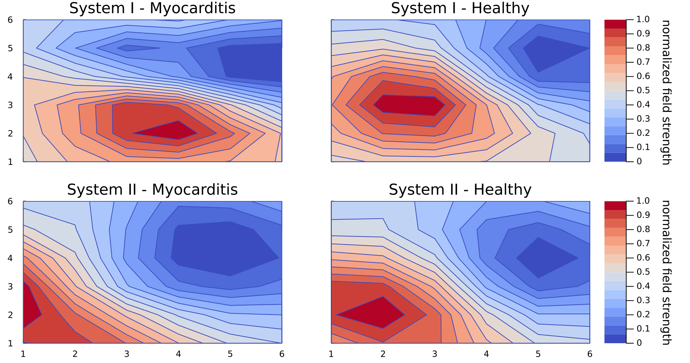

### KLE Analysis

This repository accompanies our paper "Cardiac magnetic field map topology quantified by Kullback-Leibler entropy identifies patients with clinically suspected myocarditis"




It does not include the data used in the paper, due to privacy regards. The data is available upon reasonable request from the corresponding author.

It does include the core methods and some auxiliaries for plotting etc. as used in the paper. Most notable are:

* `MKG`: A general data type to store and process magnetic field maps

* `preprocess()`: A function to preprocess the MKG data

* `getReferenceMap()`: Create a reference map from a certain subgroup

* `KLE()`: Compute the KLE between two MKG maps

* `generateReport()`: Generate a report on the predictive power of the KLE between two subgroups using LDA and performing cross validation

### Setup 

To run this code you need to have [Julia](https://julialang.org/downloads/) installed.

After that you can install the dependencies from the Project.toml file by running:

```julia
using Pkg
Pkg.activate("./path_to/KLE_Analysis")
Pkg.instantiate()
```
